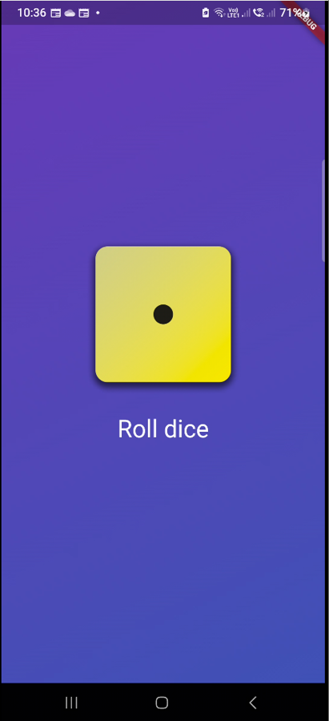
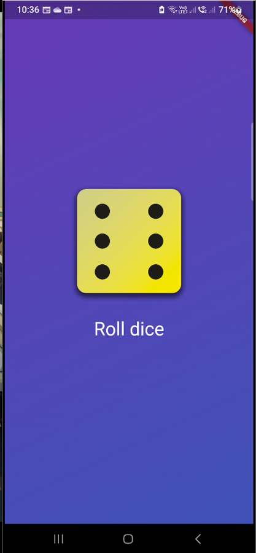

# Roll Dice App
 

## About:
Uses a random number generator to pick a number between 1-7 (n7 is not included). The app will change the image of the die on the screen to match the number that was generated.

## Images
<table>
  <tr>
    <th>Screen Name</th>
    <th>Screenshot</th>
  </tr>
  <tr>
    <td><strong>Start Screen</strong></td>
    <td></td>
  </tr>
  <tr>
    <td><strong>Dice Rolled</strong></td>
    <td></td>
  </tr>
</table>
